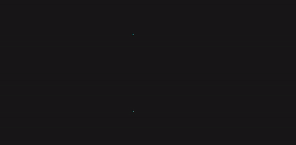

  

<h1 align="center">Portfolio LA | Leonardo Alencar</h1>

This is my portfolio's new version

  
  
  

  

<h2>🔥Technologies</h2>
<ul>
  <li>HTML</li>
  <li>CSS</li>
  <li>JS</li>
  <li><a href="https://sass-lang.com/">SASS</a></li>
  <li>Projected on <a href="https://www.figma.com/">Figma</a> & Coded on <a href="https://code.visualstudio.com/">VSCode</a></li>
</ul>

<h2 align="center">❤️developed with love by Leonardo Alencar❤️</h2>

<b>FOLLOW ME!</b>

  
  
  
  
  

LA | Leonardo Alencar.

